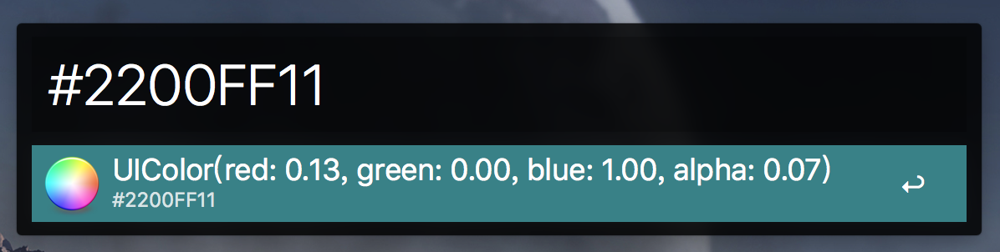

# alfred-icolor
[](https://travis-ci.org/rudeigerc/alfred-icolor)
[](https://github.com/rudeigerc/alfred-icolor)
[](https://opensource.org/licenses/MIT)

>  An Alfred workflow to generate colors from hex string (for personal use).


## Installation

```
$ cd ~/Documents/Alfred.alfredpreferences/workflows/
$ git clone https://github.com/rudeigerc/alfred-icolor.git
$ cd alfred-icolor
$ npm install
```

*Require [Node.js](https://nodejs.org) 4+ and the Alfred [Powerpack](https://www.alfredapp.com/powerpack/).*

## Screenshot


## Usage

In Alfred, type the hex string which represents colors, starting with `#`.

### Config
See `config.js`.

### Input
```
#FFFFFFFF
```

### Output
```swift
UIColor(red: 1.00, green: 1.00, blue: 1.00, alpha: 1.00)
```

## Reference

- [UIColor-Hex-Swift](https://github.com/yeahdongcn/UIColor-Hex-Swift)

## License

**alfred-icolor** is available under the MIT License.
